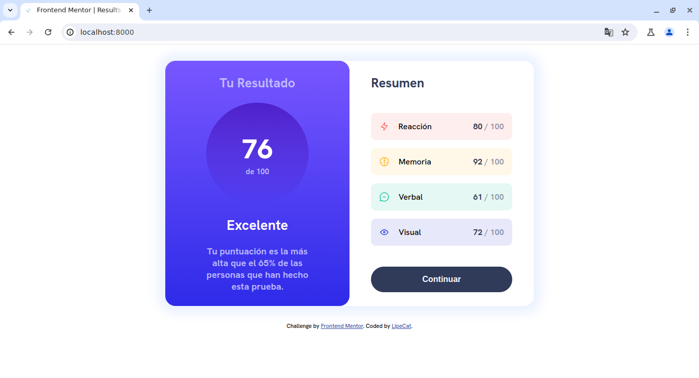

# Frontend Mentor - Results summary component solution

This is a solution to the [Results summary component challenge on Frontend Mentor](https://www.frontendmentor.io/challenges/results-summary-component-CE_K6s0maV). Frontend Mentor challenges help you improve your coding skills by building realistic projects.

## Table of contents

- [Overview](#overview)
  - [The challenge](#the-challenge)
  - [Screenshot](#screenshot)
  - [Links](#links)
- [My process](#my-process)
  - [Built with](#built-with)
  - [What I learned](#what-i-learned)
  - [Continued development](#continued-development)
  - [Useful resources](#useful-resources)
- [Author](#author)

## Overview

### The challenge

Users should be able to:

- View the optimal layout for the interface depending on their device's screen size
- See hover and focus states for all interactive elements on the page
- **Bonus**: Use the local JSON data to dynamically populate the content

### Screenshot



### Links

- Solution URL: [Add solution URL here](https://your-solution-url.com)
- Live Site URL: [Add live site URL here](https://your-live-site-url.com)

## My process

### Built with

- HTML5 markup
- CSS
- Flexbox
- Media query for responsive
- XMLHttpRequest

### What I learned

I learned a little bit how to handle the XMLHttpRequest object and work the JSON file to load dynamic values.

```js
const http_request = new XMLHttpRequest();

http_request.onreadystatechange = function () {};
```

### Continued development

I'll continue working in CSS for a better or readable code and also in JavaScript for new methods and a code more efficiently.

### Useful resources

- [XMLHttpRequest](https://developer.mozilla.org/en-US/docs/Web/API/XMLHttpRequest/readystatechange_event) - This guided me in the handling of the XMLHttpRequest object.
- [Media Query (Burguer menu)](https://www.youtube.com/watch?v=JrNebzIUrt4&pp=ygUQbWVudSBoYW1idXJndWVzYQ%3D%3D) - This is not a media query video but helped me to handle it.

## Author

- Website - [LipeCat](https://github.com/LipeCat?tab=repositories)
- Frontend Mentor - [@LipeCat](https://www.frontendmentor.io/profile/LipeCat)
